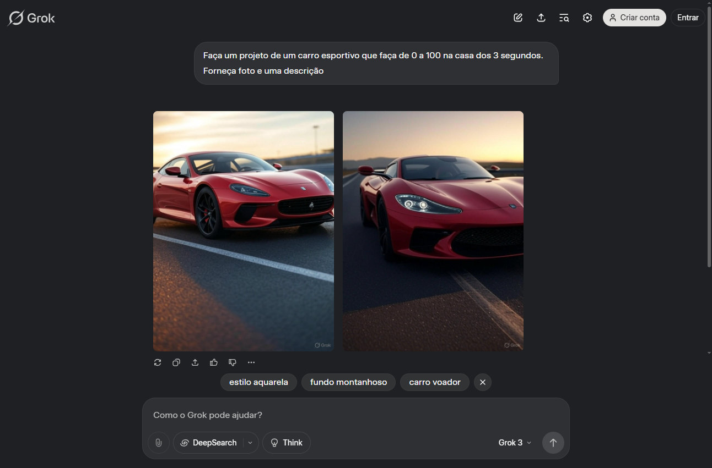
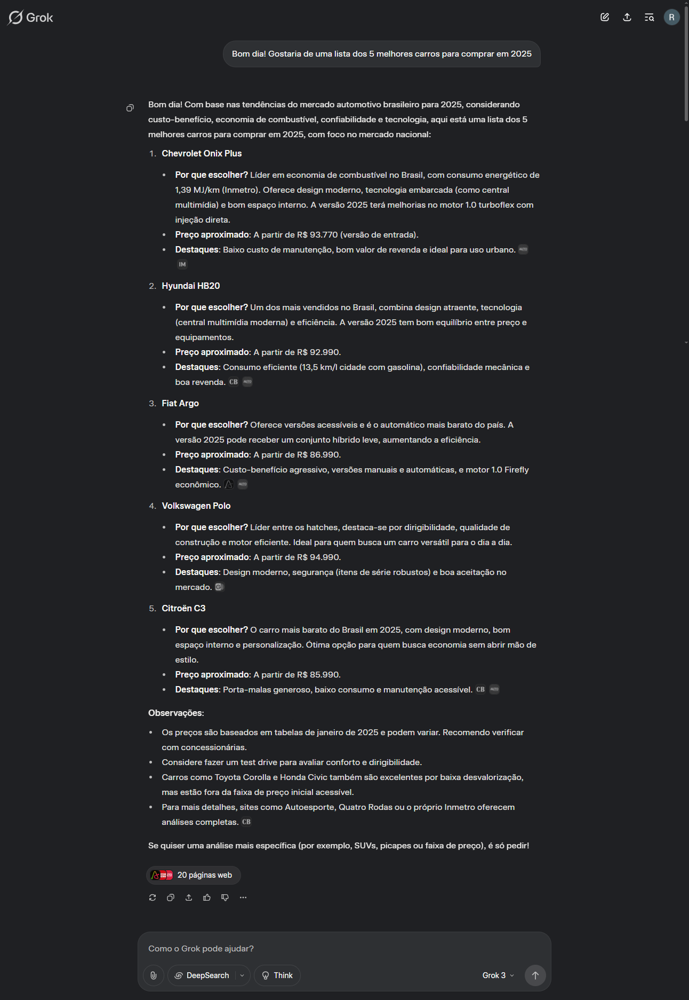
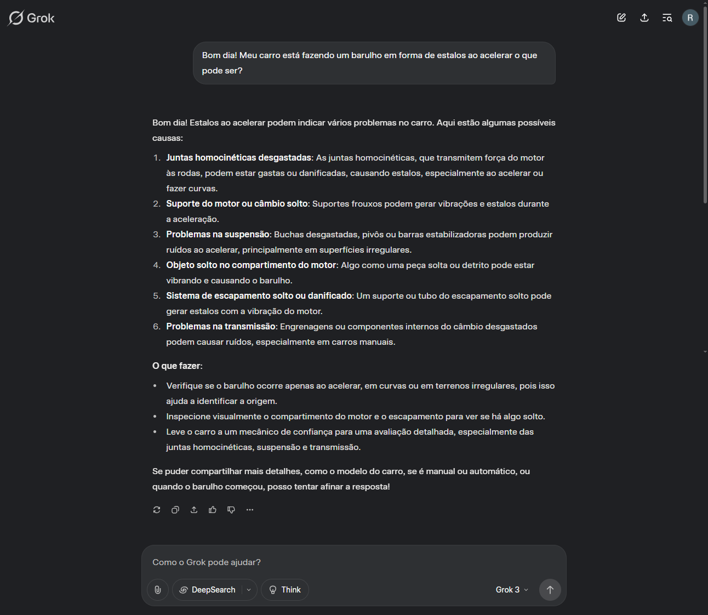

# 🚀 Projeto: Engenharia de Prompt

## 🌟 Visão Geral
Este projeto demonstra a aplicação de engenharia de prompt para criar conteúdo automotivo claro, estilizado e funcional. Usamos técnicas como Chain of Thought e Zero-Shot Prompting para otimizar prompts, gerando resultados precisos.

## 🛠️ Engenharia de Prompt

### Prompt 1:
- **Prompt Inicial**: Faça um projeto de um carro esportivo que faça de 0 a 100 na casa dos 3 segundos. Forneça foto e descrição
  - 
- **Observação**: Forneceu somente imagens, sem descrição.
- **Técnica**: Chain of Thought
- **Prompt Otimizado**: Crie uma ficha técnica detalhada de  um supercarro de pista projetado para entusiastas, equipado com motor V8 4.0L biturbo entregando mais de 750 cv, peso inferior a 1.300 kg e tração AWD adaptativa. Inclua dimensões precisas (comprimento, largura, altura), desempenho (0-100 km/h em 2,7 s, velocidade máxima), e um design inspirado em jatos stealth com linhas fluidas, cores exclusivas (Midnight Sapphire e Solar Flare), e aerofólio ativo. Apresente em uma tabela clara e um texto descritivo visualmente atraente, destacando a estética futurista.
- **Resultado**:
  - Especificação | Detalhes
  - Modelo | Hyperion V8 Turbo (Coupé 2 portas)
  - Dimensões | 4.450 mm (C) x 1.920 mm (L) x 1.180 mm (A)
  - Peso | 1.230 kg (fibra de carbono, titânio)
  - Motor | V8 4.0L biturbo + híbrido leve, 800 cv, 850 Nm
  - Desempenho | 0-100 km/h: 2,7 s; Vel. máx.: 345 km/h
  - Design | Fibra de carbono acetinada, faróis LED, aerofólio ativo, cores Midnight Sapphire e Solar Flare
  - ✨ Estética: O Hyperion combina linhas stealth com uma carroceria acetinada que reflete luz sutilmente. Faróis LED ultrafinos e rodas de titânio em forma de turbina criam um visual futurista. O interior em alcântara é minimalista e imersivo.
    
- **Diferenças**:
  - Adicionou um nome específico ("Hyperion V8 Turbo") e um público-alvo ("entusiastas de pista"), dando contexto e propósito.
  - Especificou detalhes técnicos (motor V8 4.0L biturbo, >750 cv, peso <1.300 kg, AWD adaptativa) e dimensões exatas, tornando o pedido mais detalhado.
  - Incluiu requisitos de formato (tabela clara, texto descritivo) e estilo (visualmente atraente, estética futurista), que não estavam no original.
  - Refinou o design (linhas fluidas, cores exclusivas, aerofólio ativo) e desempenho (0-100 km/h em 2,7 s), aumentando a precisão e a riqueza visual.

### Prompt 2:
- **Prompt Inicial**: Gostaria de uma lista de 5 melhores carros para compra em 2025
  - 
    
- **Observação**: Forneceu uma lista, mas de forma mais simples, sem detalhes de conforto ou estética.
- **Técnica**: Zero-Shot Prompting

- **Prompt Otimizado**: Liste 5 carros econômicos mais populares no Brasil em 2025, certificados pelo Inmetro, com preço máximo de R$110.000, porta-malas superior a 250L, e sistema multimídia integrado. Apresente uma tabela detalhada com modelo, preço estimado, consumo (km/l em cidade e estrada), motorização, conforto (espaço interno, airbags), e estética (design moderno ou robusto). Inclua recomendações específicas para uso urbano, familiar ou econômico, considerando a realidade brasileira (combustíveis flex, estradas variadas).
  
- **Resultado**:
  - Modelo | Preço (R$) | Consumo (km/l) | Motor | Conforto | Estética
  - Chevrolet Onix Plus | 105.490 | 13,9 / 17,4 | 1.0 flex, 82 cv | 469L, 6 airbags, multimídia 8” | Linhas modernas, grade elegante
  - Fiat Cronos | 100.900 | 13,5 / 16,6 | 1.0 flex, 75 cv | 525L, 4 airbags, multimídia 7” | Visual clássico, robusto
  - Hyundai HB20S | 97.690 | 13,0 / 16,0 | 1.0 flex, 80 cv | 475L, 6 airbags, automático | Grade hexagonal, dinâmico
  - Renault Kwid | 76.089 | 15,3 / 15,7 | 1.0 flex, 71 cv | 290L, 4 airbags, compacto | Estilo SUV, cores vibrantes
  - Volkswagen Polo | 96.490 | 13,7 / 16,1 | 1.0 flex, 84 cv | 300L, 4 airbags, robusto | Linhas sóbrias, elegantes
  - 💡 Recomendações: Famílias: Onix Plus ou Cronos (espaço amplo). Uso Urbano: Kwid (economia) ou Polo (robustez). Conforto: HB20S (automático, acabamento premium).
  - 
- **Diferenças**:
  - Adicionou critérios específicos (econômicos, certificados pelo Inmetro, preço até R$110.000, porta-malas >250L, multimídia), restringindo o escopo.
  - Incluiu uma estrutura detalhada para a tabela (modelo, preço, consumo, motor, conforto, estética) e recomendações específicas (uso urbano, familiar, econômico), ausentes no original.
  - Contextualizou para o Brasil (combustíveis flex, estradas variadas), alinhando com a realidade local, o que não estava implícito.
  - Passou de uma solicitação genérica ("melhores carros") para uma demanda estruturada e informativa.

### Prompt 3:
- **Prompt Inicial**: Meu carro está fazendo um barulho em forma de estalos ao acelerar o que pode ser?
  
  - 
- **Observação**: Forneceu uma análise inicial, mas sem fluxograma ou custos detalhados.
- **Técnica**: Chain of Thought
- **Prompt Otimizado**: Diagnostique estalos ao dar partida em uma Hilux D4D 2010 (diesel 3.0L, ~150.000–300.000 km). Liste causas, sintomas, testes e soluções em tabela. Priorize verificações e inclua fluxograma textual simples. Use linguagem acessível.

- **Resultado**:
  - Causa | Sintomas | Teste | Solução | Custo (R$)
  - Bateria Fraca | Cliques rápidos, luzes fracas | Multímetro (>12,4 V) | Trocar bateria | 600–1,200
  - Motor de Arranque | Clique único | Testar corrente | Reparar/substituir | 400–2,500
  - Velas de Incandescência | Estalos a frio, fumaça | Luz de pré-aquecimento | Substituir velas | 300–800
  - Bicos Injetores | Falhas, fumaça preta | Scanner OBD2 | Limpar/substituir bicos | 300–1,500 (bico)
  - Tuchos Hidráulicos | Tique-tique a frio | Verificar óleo | Trocar óleo/tuchos | 300–2,000
  - 🔍 Fluxograma: Cliques rápidos? → Teste bateria. Clique único? → Cheque arranque. Estalos a frio? → Verifique velas. Falhas? → Teste bicos. Tique-tique? → Inspecione óleo.
- **Diferenças**:
  - Especificou o veículo (Toyota Hilux D4D 2010, diesel 3.0L, 150.000–300.000 km) e corrigiu o contexto (estalos ao dar partida, não ao acelerar), alinhando com o problema real.
  - Adicionou um enfoque geográfico (uso típico no Brasil) e detalhes de diagnóstico (causas, sintomas, testes, custos, fluxograma), ausentes no original.
  - Incluiu uma estrutura tabular e um fluxograma passo a passo, tornando o resultado mais organizado e prático.
